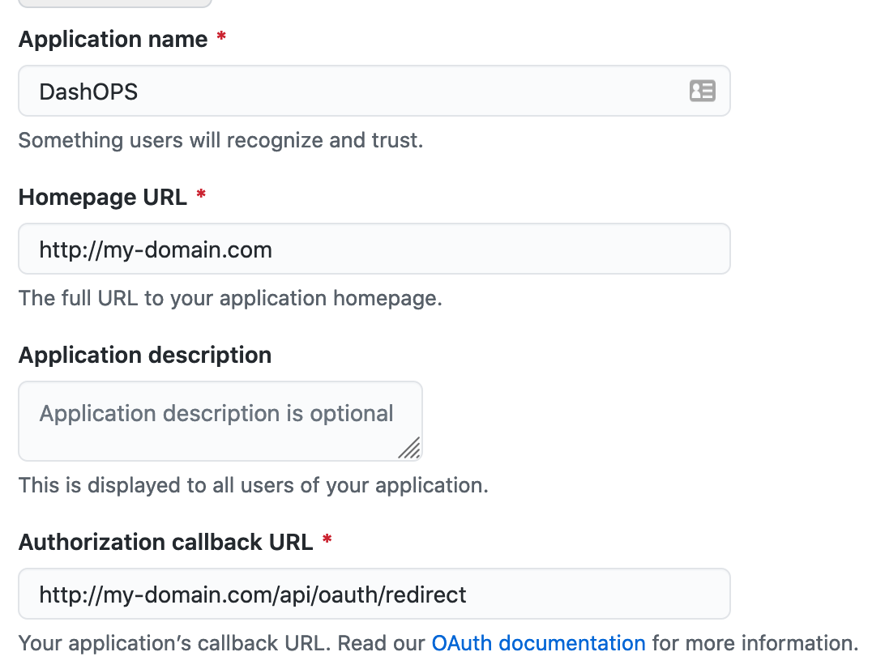

# Auth Plugin

> **⚠️ Beta Plugin** - Basic authentication features only. Not production-ready.

The Auth plugin provides GitHub-based authentication for DashOPS, enabling secure access control and organization-level permissions.

## 🎯 Features

- **GitHub Auth** - Integration with GitHub authentication
- **Organization Validation** - Restrict access to specific GitHub organizations
- **Team-based Permissions** - Basic role assignment via GitHub teams
- **Session Management** - Token-based authentication (browser storage)

## 🔧 Configuration

### **1. GitHub OAuth App Setup**

First, create a GitHub OAuth App in your organization:

1. **Navigate to GitHub Settings**

   - Go to your GitHub organization
   - Click `Settings` → `Developer settings` → `OAuth Apps`

2. **Register New Application**

   - **Application name**: `DashOPS`
   - **Homepage URL**: `https://your-domain.com` (or `http://localhost:8080` for local)
   - **Authorization callback URL**: `http://localhost:8080/api/oauth/redirect`

   

3. **For Local Development**

   Use these URLs for local testing:

   - **Homepage URL**: `http://localhost:5173`
   - **Authorization callback URL**: `http://localhost:8080/api/oauth/redirect`

   

4. **Copy Credentials**
   - Save the generated `Client ID` and `Client Secret`

### **2. DashOPS Configuration**

Add Auth configuration to your `dash-ops.yaml`:

```yaml
# Enable Auth plugin
plugins:
  - 'Auth'

# Auth configuration
auth:
  - provider: github
    clientId: ${GITHUB_CLIENT_ID} # From environment variable
    clientSecret: ${GITHUB_CLIENT_SECRET} # From environment variable
    authURL: 'https://github.com/login/oauth/authorize'
    tokenURL: 'https://github.com/login/oauth/access_token'
    redirectURL: 'http://localhost:8080/api/oauth/redirect' # Backend callback
    urlLoginSuccess: 'http://localhost:5173' # Frontend success redirect
    orgPermission: 'your-github-org' # Replace with your org name
    scopes:
      - user # User profile access
      - repo # Repository access (if needed)
      - read:org # Organization membership validation
```

### **3. Environment Variables**

Set these environment variables before running DashOPS:

```bash
# Required Auth credentials
export GITHUB_CLIENT_ID="your-github-oauth-client-id"
export GITHUB_CLIENT_SECRET="your-github-oauth-client-secret"
```

## 🔐 Security & Permissions

### **Organization-based Access Control**

DashOPS validates that users belong to the specified GitHub organization:

```yaml
auth:
  - provider: github
    orgPermission: 'dash-ops' # Only members of 'dash-ops' org can access
```

### **Team-based Permissions** (Basic)

> **⚠️ Beta Limitation**: Advanced RBAC is not yet implemented.

Current permission format:

```yaml
# In plugin configurations
permission:
  feature:
    action: ['org*team'] # Format: organization*team-name
```

Example:

```yaml
kubernetes:
  - name: 'Dev Cluster'
    permission:
      deployments:
        start: ['dash-ops*developers'] # Only 'developers' team can start
        stop: ['dash-ops*sre'] # Only 'sre' team can stop
```

## 🔑 Authentication Flow

### **Login Process**

1. **User clicks "Login"** → Redirected to GitHub OAuth
2. **GitHub Authorization** → User approves application access
3. **GitHub Callback** → GitHub redirects to DashOPS backend
4. **Token Exchange** → Backend exchanges code for access token
5. **Organization Validation** → Backend checks org membership
6. **Session Creation** → Frontend receives and stores token
7. **Dashboard Access** → User can access DashOPS features

### **Session Management**

- **Token Storage**: Browser `localStorage` (namespace: `dash-ops:token`)
- **Token Validation**: Automatic validation on each API request
- **Auto-logout**: Invalid tokens trigger automatic logout
- **Session Expiry**: Follows GitHub token expiration

## 🚨 Beta Limitations

### **Current Security Issues**

❌ **Not Production Ready**

- **Plain text storage** - Tokens stored unencrypted in browser
- **No session encryption** - Basic token-based authentication
- **Limited audit trail** - Basic logging only
- **No MFA support** - Single-factor authentication only
- **Basic permissions** - Simple org/team validation only

### **Missing Features**

- **Multiple Auth providers** - Only GitHub supported
- **Advanced RBAC** - Fine-grained permission system
- **Session management** - Server-side session handling
- **Token refresh** - Automatic token renewal
- **Account linking** - Multiple identity provider support

## 🛣️ Planned Enhancements

### **Security Roadmap**

**Q1 2025**

- **Encrypted token storage** - Secure credential management
- **Server-side sessions** - Stateful authentication
- **Enhanced audit logging** - Comprehensive action tracking

**Q2 2025**

- **Multi-provider SSO** - SAML, OIDC, Active Directory
- **Advanced RBAC** - Resource-level permissions
- **MFA support** - Two-factor authentication

**Q3 2025**

- **Compliance features** - SOC2, ISO27001 readiness
- **API security** - Rate limiting, token scoping
- **Account federation** - Cross-provider identity linking

## 🐛 Troubleshooting

### **Common Issues**

#### **Login Fails with "Unauthorized"**

- ✅ Check GitHub OAuth App configuration
- ✅ Verify `orgPermission` matches your GitHub org
- ✅ Ensure user is a member of the specified organization

#### **Token Errors**

- ✅ Check `GITHUB_CLIENT_ID` and `GITHUB_CLIENT_SECRET` environment variables
- ✅ Verify callback URL matches GitHub OAuth App settings
- ✅ Clear browser localStorage: `localStorage.clear()`

#### **Permission Denied**

- ✅ Verify user's GitHub team membership
- ✅ Check plugin permission configuration
- ✅ Ensure correct team naming format: `org*team`

### **Debug Mode**

Enable verbose logging for troubleshooting:

```bash
# Backend debug logs
LOG_LEVEL=debug go run main.go

# Frontend debug (browser console)
localStorage.setItem('dash-ops:debug', 'true')
```

## 📚 Additional Resources

- **[GitHub OAuth Apps Documentation](https://docs.github.com/en/developers/apps/building-oauth-apps)**
- **[GitHub Organizations API](https://docs.github.com/en/rest/orgs)**
- **[OAuth2 Specification](https://tools.ietf.org/html/rfc6749)**

## 🤝 Contributing

To contribute to the Auth plugin:

1. **Security improvements** - Enhanced authentication methods
2. **Provider support** - Additional Auth providers
3. **Permission system** - Advanced RBAC implementation
4. **Testing** - Authentication flow tests
5. **Documentation** - Setup guides and troubleshooting

---

**⚠️ Beta Notice**: This plugin is under active development. Security features are basic and not suitable for production environments.
